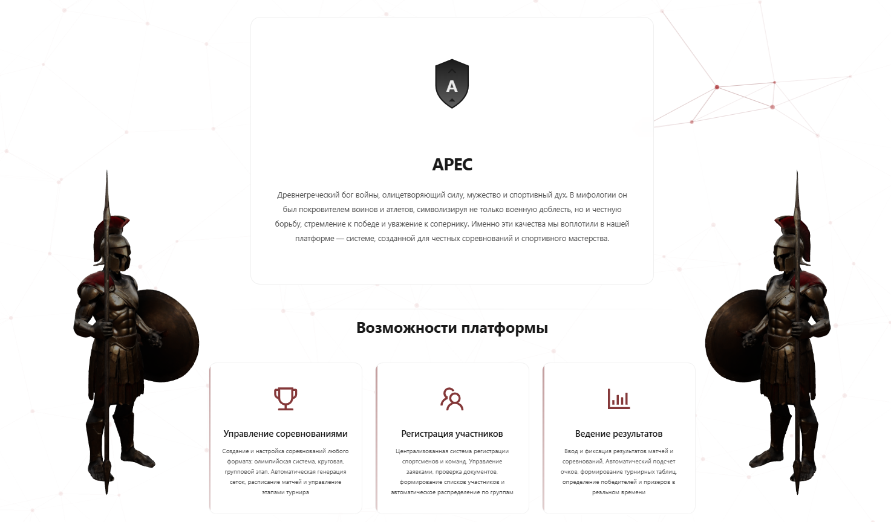
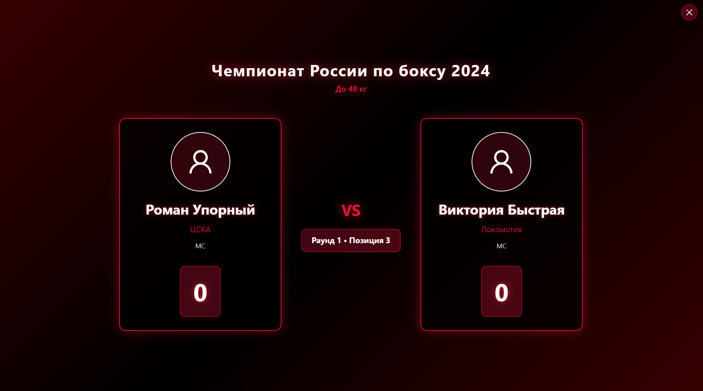
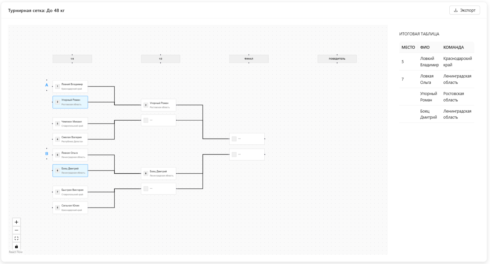
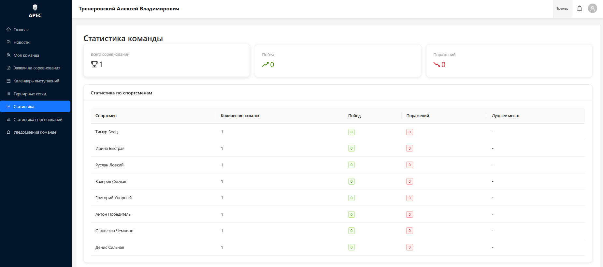

  

# APEC

**Веб-платформа для организации и проведения спортивных соревнований**

Учёт участников, команд, тренеров и судей · Турнирные сетки · Заявки и отчёты · Новости и трансляции

**Релизы:** [Скачать последнюю версию](https://github.com/nrd0736/Ares/releases) · 

---

## О проекте

APEC (ARES Platform) — единая система для спортивных федераций и организаций: от публичного сайта с новостями и календарём до личных кабинетов администратора, судей, тренеров и спортсменов. Гости видят контент без регистрации; авторизованные пользователи работают в панелях по ролям с разграничением доступа.

**Основные возможности:**

- Единая база пользователей (администраторы, модераторы, судьи, тренеры, спортсмены) и команд
- Создание соревнований (личные и командные), управление заявками и участниками
- Турнирные сетки (одиночное/двойное выбывание, круговая система), внесение и подтверждение результатов
- Публикация новостей, документов и ссылок на прямые трансляции
- Настройка визуального представления организации (название, логотип, описание)
- Системные логи действий, резервное копирование и формирование отчётов

Регистрация тренеров — только по приглашению администратора; спортсмены привязываются к тренеру с одобрением заявки.

---

## Скриншоты

<table>
<tr>
<td width="50%">

**Главная страница (гостевой интерфейс)**

</td>
<td width="50%">

**Режим работы - киоск**

</td>
</tr>
<tr>
<td width="50%">

**Турнирные сетки**

</td>
<td width="50%">

**Личный кабинет тренера**

</td>
</tr>
</table>

---

## Роли пользователей

| Роль | Краткое описание |
|------|------------------|
| **Гость** | Просмотр новостей, соревнований, календаря, документов, трансляций; регистрация команды; обратная связь; вход и регистрация. |
| **Администратор** | Полный доступ: пользователи, команды, приглашения, соревнования, сетки, календарь, новости, трансляции, документы, справочники, настройки организации, бэкапы, логи, статистика, уведомления, обращения, модерация команд, отчёты. |
| **Модератор** | Доступ только к разделам из списка разрешённых вкладок (настраивает администратор). |
| **Судья** | Турнирные сетки, подтверждение результатов, режим киоска, статистика соревнований, календарь, уведомления, обращения. |
| **Тренер** | Управление командой и спортсменами, заявки на соревнования, календарь выступлений, турнирные сетки, статистика, уведомления команде. |
| **Спортсмен** | Портфолио, статистика, история соревнований, турнирные сетки, календарь, новости. |

---

## Технологический стек

| Часть | Технологии |
|-------|------------|
| **Backend** | Node.js, Express, TypeScript, Prisma, PostgreSQL, JWT, Socket.IO, Winston, Multer |
| **Frontend** | React, TypeScript, Vite, Ant Design, Redux Toolkit, React Router, Tailwind CSS, Chart.js, Socket.IO client |
| **Инфраструктура** | npm workspaces, PostgreSQL, развёртывание через PowerShell-скрипт (Windows) |

Backend: REST API, аутентификация по JWT, загрузка файлов, WebSocket для обновлений в реальном времени. Frontend: SPA с маршрутизацией по ролям, адаптивная вёрстка, отдельный гостевой интерфейс.

---

## Безопасность

Реализованы: аутентификация по JWT и проверка ролей; хранение паролей (bcrypt); валидация паролей при регистрации; ограничение частоты запросов (общее, на вход, на загрузки); HTTP-заголовки (Helmet); CORS; санитизация HTML; проверка загружаемых файлов (MIME, magic bytes); защита от path traversal; маскирование персональных данных в логах. Подробнее — в [документации по защите и логированию](Doc/SECURITY_AND_LOGGING.md).

---

## Быстрый старт

1. **Требования:** Node.js ≥ 18, PostgreSQL (например 16), Windows (для скрипта развёртывания).
2. Клонируйте репозиторий, запустите Start.bat или перейдите в `APEC/scripts` и запустите `.\manage.ps1`.
3. Выполните **пункт 1** (Initialization) — проверка окружения, создание БД, установка зависимостей.
4. Выполните **пункт 5** (Configuration) — настройка .env, миграции, справочники.
5. Выполните **пункт 6** (Create Admin User) — создание первого администратора.
6. Выполните **пункт 2** (Start Application) — запуск backend и frontend.

Подробное пошаговое описание — в [руководстве по развёртыванию](Doc/DEPLOYMENT.md).

---

## Документация

| Документ | Описание |
|----------|----------|
| [**CONFIGURATION.md**](Doc/CONFIGURATION.md) | Ручная настройка переменных окружения (backend и frontend .env). |
| [**FUNCTIONALITY.md**](Doc/FUNCTIONALITY.md) | Подробное описание функционала по ролям и вкладкам интерфейса. |
| [**SECURITY_AND_LOGGING.md**](Doc/SECURITY_AND_LOGGING.md) | Механизмы защиты и логирования. |
| [**DEPLOYMENT.md**](Doc/DEPLOYMENT.md) | Развёртывание с помощью скрипта manage.ps1 (все пункты меню). |
| [**PROJECT_DESCRIPTION.md**](Doc/PROJECT_DESCRIPTION.md) | Расширенное описание проекта и стека. |
| [**THIRD_PARTY_LICENSES.txt**](Doc/THIRD_PARTY_LICENSES.txt) | Лицензии используемых технологий и библиотек (English). |
| [**license.txt**](Doc/license.txt) | Лицензионное соглашение на использование ПО. |

Вся документация опирается на исходный код проекта (каталог `APEC`).

---

## Контакты

По вопросам по проекту — в Telegram: [@Ares_platform](https://t.me/Ares_platform)  

---

## Автор и лицензия

**Бакулин Никита Сергеевич**  
APEC © 2026. Все права защищены.

Использование ПО регулируется [license.txt](Doc/license.txt). Лицензии сторонних компонентов — в [THIRD_PARTY_LICENSES.txt](Doc/THIRD_PARTY_LICENSES.txt).
